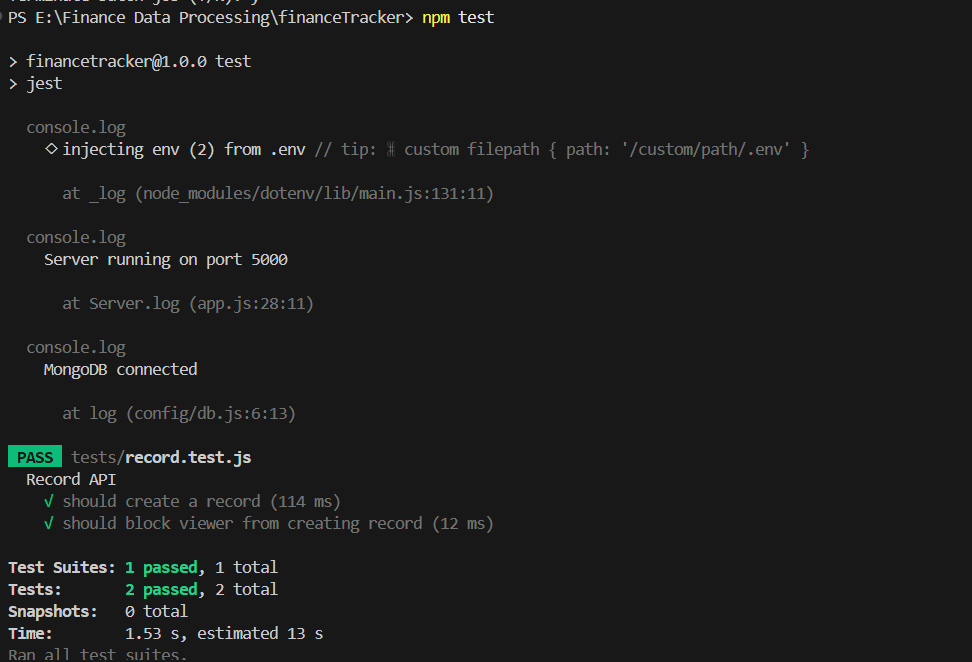
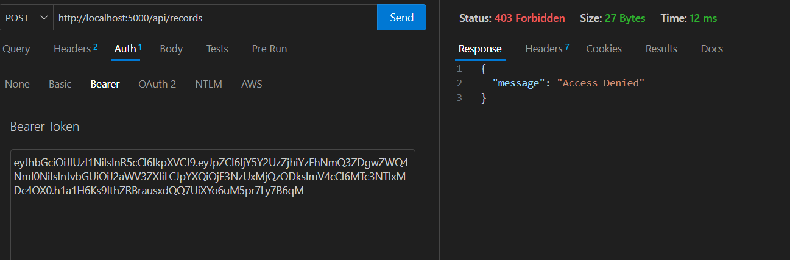
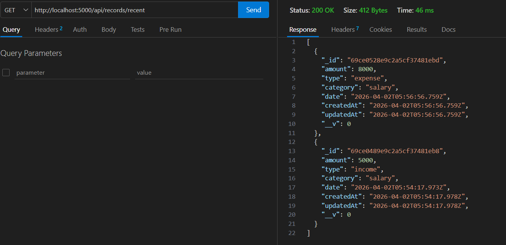
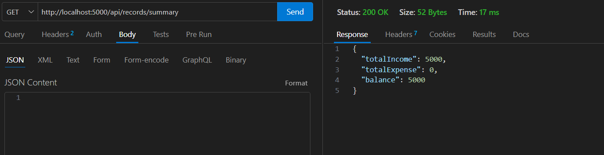
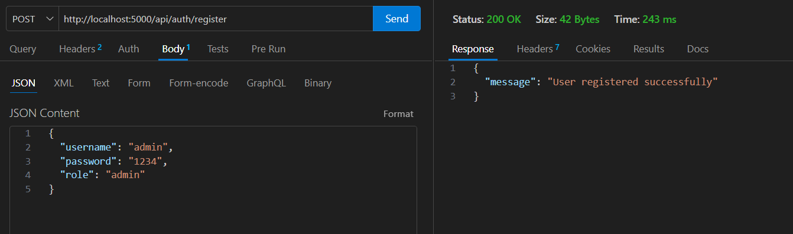
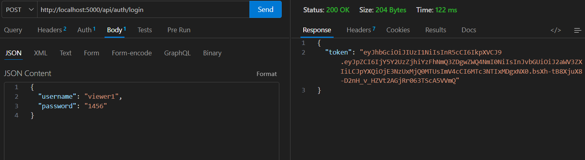

# 💰 Finance Tracker Backend API

## 📌 Overview

This is a backend application for managing financial records like income and expenses. It demonstrates backend concepts such as REST APIs, authentication, role-based access control, and dashboard data aggregation.

---

## 🚀 Features

### 🔹 Authentication & Users

* User registration & login
* JWT-based authentication
* Role-based access (Admin, Analyst, Viewer)
* Active/Inactive user handling

---

### 🔹 Financial Records

* Create, update, delete records
* View records with filters (type, category, date)

---

### 🔹 Dashboard APIs

* Total income & expenses
* Net balance
* Category-wise summary
* Recent transactions

---

### 🔹 Validation & Security

* Input validation
* Proper error handling
* Secure routes using middleware
* Role-based authorization

---

### 🔹 Testing

* Integration tests using Jest & Supertest
* Tested role-based access scenarios using VS code Thunder Client

---

### 📌 Assumptions
* Authentication is implemented using JWT.
* Roles are assigned during user registration.
* Role is extracted from token for authorization.
* No frontend is included (API-focused backend).

---

## 🛠️ Tech Stack

* Node.js
* Express.js
* MongoDB (Mongoose)
* JWT (Auth)
* Jest & Supertest

---

## ⚙️ Setup Instructions

### 1. Install dependencies

```bash
npm install
```

### 2. Create `.env` file

```env
PORT=5000
MONGO_URI=your_mongodb_uri
JWT_SECRET=your_secret_key
```

### 3. Run the server

```bash
npx nodemon app.js
```

---

## 📡 API Endpoints

### 🔐 Auth

* POST `/api/auth/register`
* POST `/api/auth/login`

### 📊 Records

* POST `/api/records` (Admin only)
* GET `/api/records` (All users)
* PUT `/api/records/:id` (Admin only)
* DELETE `/api/records/:id` (Admin only)

### 📈 Dashboard

* GET `/api/records/summary` (Analyst, Admin)
* GET `/api/records/category-summary` (Analyst, Admin)
* GET `/api/records/recent` (Analyst, Admin)

---

## 🔐 Authorization

Include token in headers:

```
Authorization: Bearer <your_token>
```

---

## 🎯 Roles

| Role    | Access           |
| ------- | ---------------- |
| Admin   | Full access      |
| Analyst | View + dashboard |
| Viewer  | View only        |

---


## 🔹 Validation & Error Handling
Input validation for all critical fields
Proper HTTP status codes used:
200 → Success
201 → Created
400 → Bad Request
401 → Unauthorized
403 → Forbidden
404 → Not Found
Prevents invalid or incomplete data from being stored

---
## 📌 Highlights

* Clean modular structure
* Secure backend design
* Role-based access control
* Aggregation-based dashboard

---

## 🧪 Test Results

The backend APIs were tested using Jest and Supertest.

All test cases passed successfully:



<br><br>



<br><br>


<br><br>


<br><br>


<br><br>


## Conclusion

This project demonstrates practical backend development skills including API design, authentication, data handling, and system security.

---
